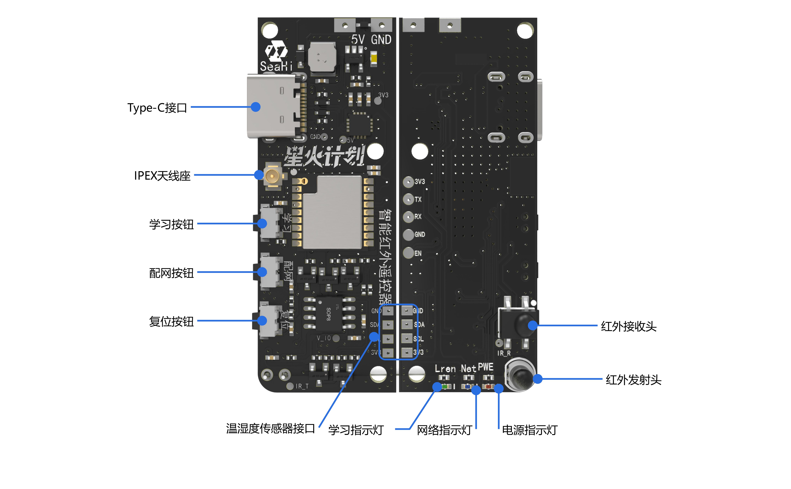
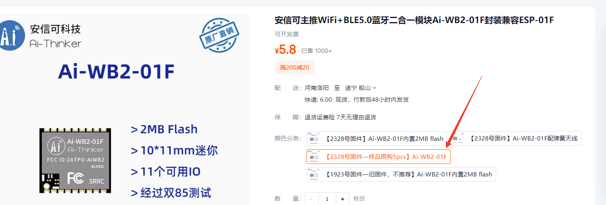
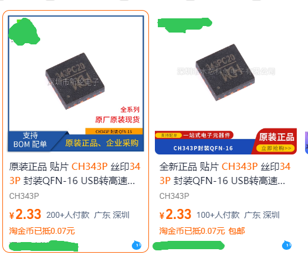
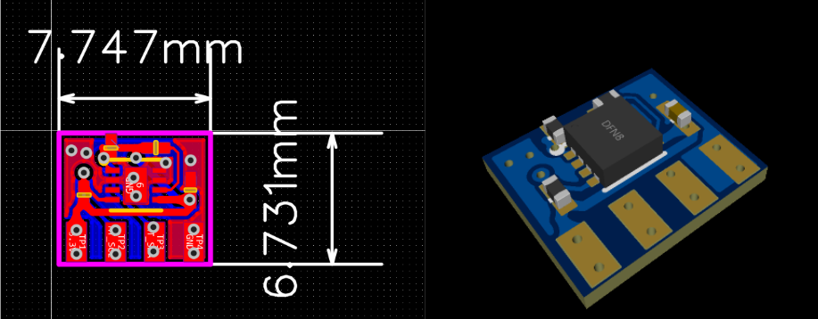
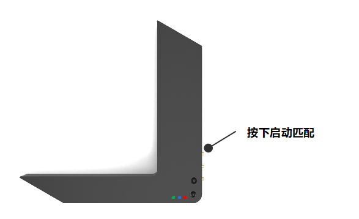
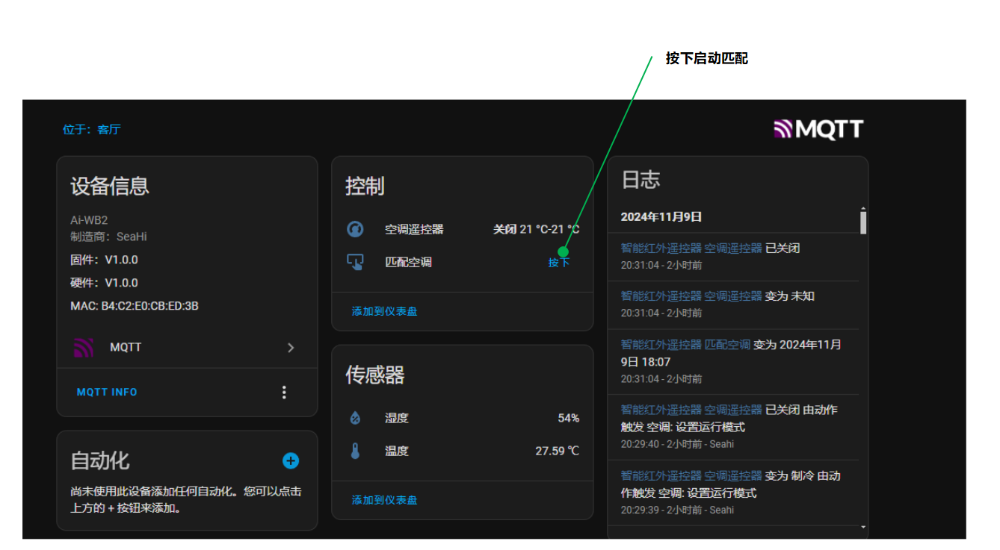
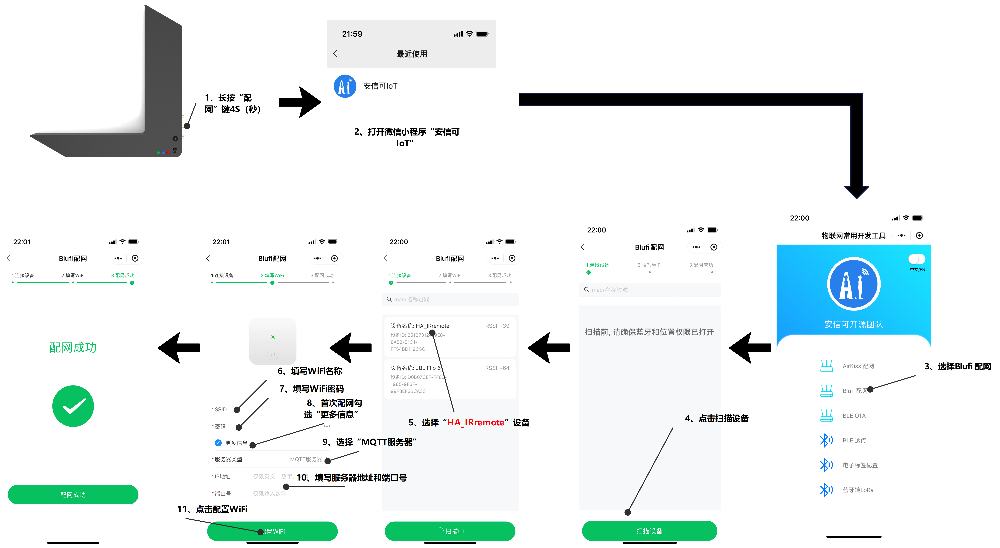

# IRAirHAIntegrate(智能红外遥控器)
## 版本日志
### V1.0
- 嘉立创夏日电子活动建立
- 支持TCL空调
- 支持美的空调
- 接入HomeAssistant
- 支持微信小程序配网
- 支持自定义MQTT服务器

### V1.1 
- 嘉立创星火计划建立
- 更改PCBA外形
- 更改红外驱动芯片为红外码库芯片
- 支持一键匹配空调
- 支持市面上大部分品牌的空调、风扇、红外电视机顶盒 
- 支持微信小程序配网
- 更改外壳形状

## 项目简介
智能红外遥控器目前只连接HomeAssistant 平台，可以在HomeAssistant 实现远程控制家里的空调设备，支持外接I2C 传感器，例如：SHT30 温湿度传感器。
此版本已经支持市面上**98%** 的空调设备，常见的**格力、美的、海尔、奥克斯、TCL**等都可以控制。支持手机控制，摆脱传统遥控器，再也不用找遥控器了！

>**额外说明：**
>本项目红外波形的生成不由主控实现，而是由另外的离线红外码库芯片实现，主控操控红外码库芯片实现控制空调。

## PCBA接口

## 项目功能
- 支持一键匹配空调（远程匹配和按键匹配）
- 支持远程控制
- 支持温湿度传感器接入（SHT30）
- 支持小程序配网
- 支持HomeAssistant自动发现
- 支持空调温度调节
- 支持空调模式调节
- 支持空调开关
- 支持掉电保存

## 项目主要参数
- ### **主控：**

主控采用安信可科技的Ai-WB2-01F模组，由它来实现连接HomeAssistant平台和控制红外芯片，下面是它的一些参数：
 - 支持 2.4GHz WiFi 和BLE 5.0
- 支持WX小程序blufi配网（安信可IOT） 
- 2M Flash
- **11个可用IO**
- **官方单价￥5.8（样品单）**
- **大小：10\*11mm**
- 供电：2.7~3.6V
- 不带天线
> 为什么不用ESP-01F的ESPHome？
> Ai-WB2-01F比ESP-01F(￥9)便宜一半的价格，还支持蓝牙,在价格面前，我还能想啥？搞DIY本来就费钱，能省则省。
> 
 

- ###  **红外芯片：**
红外芯片采用HXD039B2，自带离线红外码库，它的参数如下：
- 单价：￥3.68(样品单)
- 供电：2.2~5.5V
- 内置空外码库，空调、风扇、电视、机顶盒等
- 支持一键匹配红外码
- 串口通讯，波特率57600
- 封装：SOP-8
- ### **USB转TTL：**
采用CH343P串口芯片，我觉得用这颗芯片有点性能过剩了，大家复刻的时候可以使用CH340N（性价比更高），因为手头刚好有，所以就用了，以下是它的参数：
- 封装：QFN16（3\*3mm），有点难焊接
- 波特率：50-6Mpbs
- 单价￥2.33(TB价)

- ### **温湿度传感器：**
温湿度传感器采用高精度的数字温湿度传感器：SHT30，并给它画了一个极小的板子：

### MQTT服务器
采用EMQX的开源版MQTT服务器，部署简单，本项目我把它部署在阿里云服务器上，设备可以在任何有网络的地方都能连接。
- 下载地址：https://www.emqx.com/zh/try?tab=self-managed
- 不采用SSL加解连接
- 端口号：1883
- 支持MQTT 3.1/5.0
- 其他配置保持默认（我甚至连后台账户密码都没改）
### FRP 内网穿透（可选）
FRP内网穿透主要是为了能够任何有网络的地方能够访问HomeAssistant，它并不是一个必选的功能，没有内网穿透，也可以在家里的局域网访问HomeAssistant。
- FRP下载地址：https://github.com/fatedier/frp/releases
- 版本：5.8.0
- 服务器：阿里云99包年服务器套餐
- 自定义的token 验证
### HomeAssistant 平台配置
- 系统类型：冬瓜HA
- 版本：最新
- 必要集成：MQTT，需自行配置MQTT服务器地址和端口号
- UI：系统默认界面，自定义布局
## 使用说明
### 一、空调码匹配
空调码匹配是很重要的步骤，这决定了能不能实现空调控制的主要操作。匹配方式分为两种，`按键匹配`、`远程匹配`。当需要控制新的空调时，才会用得上匹配功能。
> **温馨提示：**
> 匹配过程中，设备会进入忙碌状态，此时不能控制空调
#### **按键启动匹配**
适用于未连接WiFi的情况，在没有连接WiFi之前，可以使用按键匹配空调码，等WiFi连接成功并连接上HomeAssistant之后，即可使用控制。

#### **远程控制匹配**
适用于已经连接上HomeAssistant的场景，可以使用HomeAssistant中的按钮来远程实现匹配功能。只是把按键匹配的方式换成了无线的，不需要靠近设备就能启动匹配功能。

> 无论哪个匹配方式，都需要读取空调遥控器的红外码来匹配。匹配成功之后，会保存当前红外码，重新上电不需要重新匹配，除非更换空调。设备目前只保存一次匹配结果，历史匹配结果还在考虑怎么实现。
### 二、配网
采用微信小程序——安信可IOT 进行配网，首次配网需要配置MQTT服务器地址和端口号！

> 注意：
> 配网时填写的MQTT地址，一定要和HomeAssistant 的MQTT集成连接MQTT服务器地址一致。

### 三、灯光提示

| LED | 功能 | 状态说明 |
| --- | --- | --- |
| 红色 | 电源指示 | 打开：亮，关闭：灭 |
| 蓝色 | 网络指示灯| 未联网:慢闪，已联网：间隔2S闪烁一次 |
| 绿色 | 匹配指示灯| 匹配状态：亮，退出匹配：灭 |
